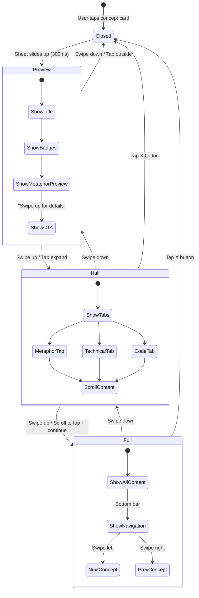

# Mobile UI States - Visual Diagram

## State Machine Flow



## Screen Layout Comparison

### BEFORE (Current Desktop Modal on Mobile)

```
┌─────────────────────────────────┐
│ ████████████████████████████████│ ← 200px header (TOO BIG)
│ █  🧠 LARGE ICON              █ │
│ █  Vector Embeddings          █ │
│ █  🟡 Intermediate  ⏱️ 5 min  █ │
│ █  [Share] [Copy] [X]         █ │
│ ████████████████████████████████│
│                                  │
│ ⚠️  LEARN THESE FIRST            │ ← Prerequisites block
│ [Tokens] [Word Embeddings] ➡️    │
│                                  │
│ ─────────────────────────────── │
│ 💡 SIMPLE EXPLANATION            │ ← Metaphor section
│ Think of vectors as coordinates  │
│ in space that represent meaning  │
│ of words in a way computers can  │
│ understand and compare. Just...  │
│ (200+ words more...)             │ ← OVERWHELMING
│                                  │
│ ─────────────────────────────── │
│ 💻 TECHNICAL EXPLANATION         │ ← Technical section
│ Vectors are numerical represent- │
│ ations in high-dimensional...    │
│ (300+ words more...)             │ ← TOO MUCH TEXT
│                                  │
│ ─────────────────────────────── │
│ 🖥️  CODE EXAMPLE                 │ ← Code section
│ ```python                        │
│ import numpy as np               │
│ vector = np.array([0.2, 0.5,..  │
│ ```                              │
│ (More code...)                   │
│                                  │
│ ═════════════════════════════════│
│ [Mark as Complete] [Close]      │ ← Footer
│ Press ESC to close               │
└─────────────────────────────────┘

TOTAL HEIGHT: ~1200-1500px
SCROLL REQUIRED: 2-3 screen heights
USER CONFUSION: "Where do I start reading?"
```

### AFTER (Progressive Bottom Sheet)

```
STATE 1: PREVIEW (30% screen height)
┌─────────────────────────────────┐
│  [Tree visualization remains    │
│   visible in background]        │ ← USER KEEPS CONTEXT
│                                  │
│  ┌─────────────────────────┐   │
│  │ ⚊⚊⚊  Swipe up          │   │ ← CLEAR AFFORDANCE
│  │                          │   │
│  │ 🧠 Vector Embeddings     │   │ ← FOCUSED INFO
│  │ 🟡 Intermediate  ⏱️ 5 min│   │
│  │                          │   │
│  │ 💡 "Think of vectors as  │   │ ← 2 LINES MAX
│  │ coordinates in space..." │   │
│  │                          │   │
│  │ ↑ Swipe up for details   │   │ ← CALL TO ACTION
│  └─────────────────────────┘   │
└─────────────────────────────────┘

TOTAL HEIGHT: 250-300px
SCROLL REQUIRED: None
USER CLARITY: "I see the key info, can expand if interested"


STATE 2: HALF-SCREEN (60% height)
┌─────────────────────────────────┐
│ ⚊⚊⚊                            │
│ [X] Vector Embeddings      [✓]  │ ← COMPACT HEADER
│ 🟡 Intermediate  ⏱️ 5 min       │
│─────────────────────────────────│
│ [💡 Metaphor] [Technical] [Code]│ ← TABS = CHOICE
│─────────────────────────────────│
│                                  │
│ ⚠️  Master these first:          │ ← PREREQUISITES
│ ✓ [Tokens] ➡️  [ ] [Embeddings] │   (COMPACT)
│                                  │
│ ─────────────────────────────── │
│                                  │
│ 💡 Simple Explanation            │
│                                  │
│ Think of vectors as coordinates  │ ← FOCUSED CONTENT
│ in space that represent the      │   (NO OVERWHELMING)
│ meaning of words in a way        │
│ computers can understand and     │
│ compare.                         │
│                                  │
│ [Keep scrolling for more...]     │ ← HINT
│                                  │
└─────────────────────────────────┘

SCROLL REQUIRED: 1-1.5 screen heights (per tab)
USER EXPERIENCE: "I can focus on one aspect at a time"


STATE 3: FULL-SCREEN (90% height)
┌─────────────────────────────────┐
│ ⚊⚊⚊ [X]                   [✓]  │ ← MINIMAL HEADER
│ Vector Embeddings                │
│─────────────────────────────────│
│ [💡 Metaphor] [Technical] [Code]│
│─────────────────────────────────│
│                                  │
│ [Full scrollable content for     │
│  currently selected tab]         │
│                                  │
│ • Prerequisites section          │
│ • Complete metaphor text         │
│ • Related concepts links         │
│ • Visual examples (if any)       │
│                                  │
│         [Scroll to continue]     │
│                ⬇️                 │
│                                  │
│─────────────────────────────────│
│ ⬅️ Tokens  [2/5]  Attention ➡️  │ ← NAVIGATION
│ [Mark Complete] [Share]          │
│         • • ● • •                │ ← PROGRESS DOTS
└─────────────────────────────────┘

SCROLL REQUIRED: 1.5-2 screen heights (per tab)
USER EXPERIENCE: "I know where I am and what's next"
```

## Touch Target Sizes (Apple HIG / Material Design)

```
BEFORE (Current - Desktop-Optimized)
┌────────────────────────────────┐
│  ⓧ  ← 32x32px  TOO SMALL!     │
│  🔗 ← 32x32px  TOO SMALL!     │
│  🐦 ← 32x32px  TOO SMALL!     │
└────────────────────────────────┘

AFTER (Mobile-Optimized)
┌────────────────────────────────┐
│  ⓧ  ← 44x44px  ✅ ACCESSIBLE  │
│  🔗 ← 44x44px  ✅ ACCESSIBLE  │
│  🐦 ← 44x44px  ✅ ACCESSIBLE  │
└────────────────────────────────┘

SPACING BETWEEN TARGETS:
Before: 8px ❌ (users miss-tap frequently)
After:  16px ✅ (comfortable thumb zone)
```

## Content Density Comparison

```
BEFORE: All-at-once (Vertical Stack)
┌─────────────────────────────────┐
│ Section 1: Prerequisites         │ ← 150px
│ Section 2: Metaphor              │ ← 400px
│ Section 3: Technical             │ ← 500px
│ Section 4: Code                  │ ← 350px
│ Section 5: Footer                │ ← 100px
│═════════════════════════════════│
│ TOTAL: 1500px                    │
│ Scroll Distance: 3x screen       │
│ Cognitive Load: HIGH             │
└─────────────────────────────────┘

AFTER: Progressive + Tabs
┌─────────────────────────────────┐
│ Preview State:        250px      │ ← Just essentials
│                                  │
│ Half State (per tab):            │
│  - Metaphor Tab:     450px      │ ← One concept
│  - Technical Tab:    500px      │ ← at a time
│  - Code Tab:         400px      │
│                                  │
│ Per-tab scroll: 1-1.5x screen   │
│ Cognitive Load: LOW              │
│ User Choice: HIGH                │
└─────────────────────────────────┘
```

## Gesture Overlay Guide

```
┌─────────────────────────────────┐
│          ⬇️ SWIPE DOWN           │
│      (Collapse/Close)            │
│                                  │
│  ⬅️                         ➡️   │
│ SWIPE         CONTENT      SWIPE│
│  LEFT                      RIGHT│
│ (Next)                    (Prev) │
│                                  │
│                                  │
│           ⬆️ SWIPE UP            │
│         (Expand Sheet)           │
└─────────────────────────────────┘

VISUAL FEEDBACK:
• Swipe Up:   Sheet follows finger, springs up
• Swipe Down: Sheet follows finger, fades out
• Swipe Left: Card slides left, next enters right
• Swipe Right: Card slides right, prev enters left

HAPTIC PATTERNS:
• Expand state change:    Light tap (10ms)
• Collapse state change:  Light tap (10ms)
• Reach navigation edge:  Medium tap (20ms)
• Mark complete:          Success pattern (10-50-10ms)
• Close sheet:            Light tap (10ms)
```

## Position Indicator Examples

### Beginner Path (5 concepts)
```
Current: Vectors (2/5)

┌─────────────────────────────────┐
│ 🚀 Beginner Path                 │
│                                  │
│  ✓ ━━━  ━━━  ···  ···           │
│  1   2    3    4    5            │
│      ▲ You are here              │
│                                  │
│ ⬅️ Tokens        Attention ➡️    │
└─────────────────────────────────┘
```

### Complex Path (Prerequisites not complete)
```
Current: RAG (1/3 prerequisites missing)

┌─────────────────────────────────┐
│ ⚠️  Prerequisites Required       │
│                                  │
│  ✓ [Vectors]  ← Completed        │
│  ✓ [Embeddings]  ← Completed     │
│  ⚠️ [Context Engineering] ← Start│
│                                  │
│ [View Context Engineering] ➡️    │
└─────────────────────────────────┘
```

### Advanced Path (Non-linear exploration)
```
Current: Flash Attention (Advanced)

┌─────────────────────────────────┐
│ 🎓 Advanced Topics               │
│                                  │
│  Related: Transformers, CUDA     │
│  Next: Quantization              │
│                                  │
│ ⬅️ Transformers  Quant. ➡️       │
└─────────────────────────────────┘
```

## Animation Timeline

```
0ms    - User taps concept card
         ├─ Card scales down (0.95x)
         └─ Backdrop fades in (opacity 0 → 0.8)

100ms  - Sheet begins sliding up
         ├─ Transform: translateY(100% → 70%)
         └─ Spring easing (damping: 30, stiffness: 300)

300ms  - Sheet reaches PREVIEW state
         ├─ Title fades in (opacity 0 → 1)
         └─ Badges stagger in (delay: 50ms each)

400ms  - Preview content fully visible
         └─ User can interact

USER SWIPES UP
─────────────────────────────────────

0ms    - Touch detected, sheet follows finger
         └─ Real-time transform based on drag offset

Release - Velocity calculated
         ├─ If velocity > 500px/s: Expand to next state
         └─ If velocity < 500px/s: Check drag distance

50ms   - State transition begins
         ├─ Sheet animates to new height
         └─ Previous content fades out

150ms  - New tab content begins fade-in
         └─ Stagger: Prerequisites → Main → Actions

300ms  - Full transition complete
         └─ Sheet locked at new height
```

## Responsive Breakpoints Strategy

```typescript
// Mobile-first approach
const breakpoints = {
  mobile: {
    max: 768,
    sheetHeights: {
      preview: '30vh',  // Short preview
      half: '60vh',     // Comfortable reading
      full: '90vh'      // Maximum without covering status bar
    },
    headerHeight: {
      preview: 80,      // Compact
      expanded: 60      // Minimal
    },
    contentPadding: 16  // Tight but readable
  },

  tablet: {
    min: 769,
    max: 1024,
    sheetHeights: {
      preview: '40vh',  // More content visible
      half: '70vh',     // Larger sweet spot
      full: '85vh'      // Leave space for context
    },
    headerHeight: {
      preview: 100,     // More breathing room
      expanded: 80
    },
    contentPadding: 24  // More generous
  },

  desktop: {
    min: 1025,
    // Use existing centered modal
    // No bottom sheet on desktop
  }
};
```

## Error States & Edge Cases

### 1. No Internet Connection
```
┌─────────────────────────────────┐
│ ⚊⚊⚊                            │
│ [X] Vector Embeddings      [✓]  │
│─────────────────────────────────│
│ ⚠️  Connection Lost              │
│                                  │
│ Some content may not be          │
│ available offline.               │
│                                  │
│ [Cached Content ✓]               │
│ [Code Examples ❌]               │
│                                  │
│ [Try Again] [Continue Offline]   │
└─────────────────────────────────┘
```

### 2. No Next Concept (End of Path)
```
┌─────────────────────────────────┐
│ ⬅️ Previous  [5/5]  🎉           │
│                                  │
│ ✨ You've completed the          │
│    Beginner Path!                │
│                                  │
│ [View Progress] [Start Advanced] │
└─────────────────────────────────┘
```

### 3. Prerequisites Incomplete
```
┌─────────────────────────────────┐
│ ⚠️  Not Ready Yet                │
│                                  │
│ Master these concepts first:     │
│                                  │
│ [ ] Tokens (5 min)               │
│ [ ] Embeddings (8 min)           │
│                                  │
│ Total time needed: ~13 min       │
│                                  │
│ [Start with Tokens] [Skip Anyway]│
└─────────────────────────────────┘
```

---

## Development Checklist

### Phase 1: Core Bottom Sheet (Week 1)
- [ ] Create `useBottomSheet` hook
  - [ ] State management (preview/half/full)
  - [ ] Height calculations based on viewport
  - [ ] Drag event handlers
- [ ] Build `ConceptBottomSheet` container
  - [ ] Backdrop with blur
  - [ ] Sheet container with rounded corners
  - [ ] Drag handle component
- [ ] Implement drag-to-expand/collapse
  - [ ] Track vertical pan gestures
  - [ ] Calculate velocity and offset
  - [ ] Smooth spring animations
- [ ] Add safe area support
  - [ ] iOS notch/home indicator
  - [ ] Android navigation bar

### Phase 2: Content Layout (Week 1-2)
- [ ] Create `ConceptTabNav` component
  - [ ] Tab buttons with icons
  - [ ] Active state indicator
  - [ ] Smooth underline animation
- [ ] Implement tab state management
  - [ ] Switch between Metaphor/Technical/Code
  - [ ] Persist active tab in URL params
- [ ] Add content transitions
  - [ ] Fade out old content
  - [ ] Fade in new content
  - [ ] Prevent layout shift
- [ ] Optimize rendering
  - [ ] Lazy load code examples
  - [ ] Virtualize long prerequisite lists

### Phase 3: Navigation (Week 2)
- [ ] Build `ConceptNavigationBar`
  - [ ] Previous/Next buttons
  - [ ] Position indicator
  - [ ] Progress dots
- [ ] Implement concept sequencing
  - [ ] Detect beginner/advanced paths
  - [ ] Calculate position in sequence
  - [ ] Handle path completion
- [ ] Add keyboard navigation
  - [ ] Arrow keys for prev/next
  - [ ] Escape to close
  - [ ] Tab key trap in modal

### Phase 4: Gestures & Polish (Week 2-3)
- [ ] Implement horizontal swipe
  - [ ] Detect swipe direction
  - [ ] Trigger navigation
  - [ ] Card slide animations
- [ ] Add haptic feedback
  - [ ] State changes
  - [ ] Button taps
  - [ ] Completion actions
- [ ] Fine-tune animations
  - [ ] 60fps target on low-end devices
  - [ ] Reduce motion for accessibility
- [ ] Add loading states
  - [ ] Skeleton screens
  - [ ] Shimmer effects

### Phase 5: Testing (Week 3)
- [ ] Cross-browser testing
  - [ ] iOS Safari 15+
  - [ ] Chrome Android 10+
  - [ ] Samsung Internet
- [ ] Performance profiling
  - [ ] Lighthouse mobile score
  - [ ] First Contentful Paint
  - [ ] Time to Interactive
- [ ] Accessibility audit
  - [ ] Screen reader testing
  - [ ] Keyboard navigation
  - [ ] Color contrast
- [ ] User acceptance testing
  - [ ] 5 users per platform
  - [ ] Task completion rates
  - [ ] SUS questionnaire

---

**Last Updated:** 2026-01-28
**Status:** Ready for Development
